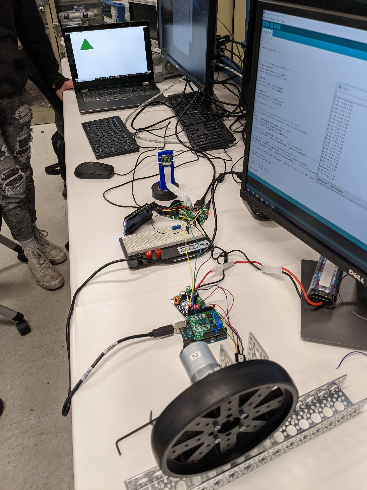

# eeng350-mini-project
Mini Project repo for EENG350

TODO: make better

# Arduino

For the arduino, several examples are provided that were used in order to test 
certain features before adding them in the final project. The final Arduino
program used was `motorTest/motorTest.ino`, which implements controls, 
localization, and I2C communication with the Pi.

# Raspberry Pi

The Pi is responsible for computer vision, managing the LCD, and all that
cool stuff. The final code used on the Raspberry Pi is `final.py`, which will 
locate a green shape on screen, print its location to the LCD, and then send an
I2C command to the Arduino. 

# MATLAB Simulations
