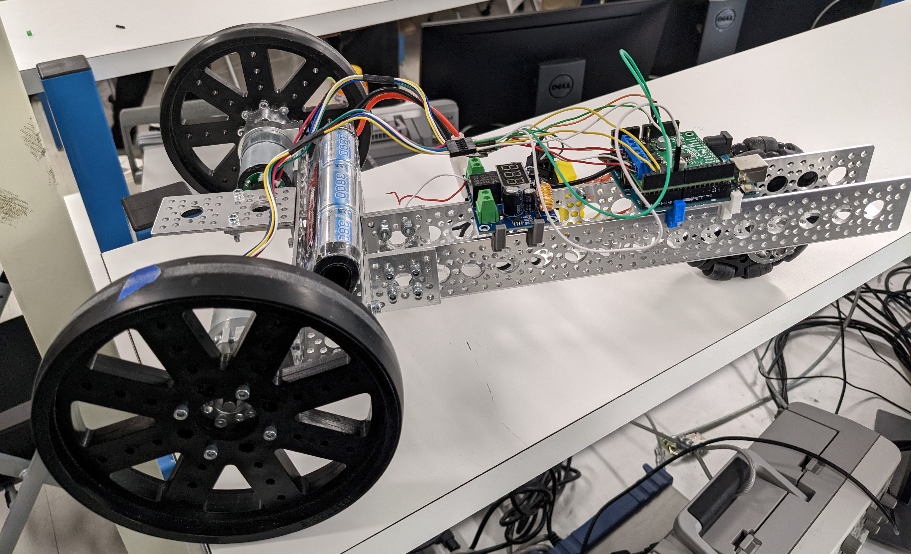

# eeng350-mini-project

Project repo for EENG350. Current release: **Final Demo**

Final Project System

The robot is capable of following the simulated warehouse path,
completing the course in 1:08. 

# Arduino

For the arduino, several examples are provided that were used in order to test 
certain features before adding them in the final project. The final Arduino
program used was `finaldemo/finaldemo.ino`, which implements controls, 
localization, and I2C communication with the Pi.

The Arduino accepts a set of commands and values, that it then acheives using 
feedback controls. Once the robot has acheived its target, the Arduino will send 
an acknowledge to the Pi to get its next command. 

# Raspberry Pi

The Pi is responsible for computer vision, managing the LCD, and 
sending commands to the Arduino via I2C. The final code used on the Raspberry Pi 
is `final.py`, which will locate tape, and find its distance and angle relative
to the robot. It will then use these distances to determine how much to turn/drive
the robot. Once the values are determined, it will use `Demo2CommsPy.py` to send a
target to the Arduino over I2C. 

# MATLAB Simulations

This directory contains the scripts, Simulink models, and data
used to tune the PI controller for our motor. The published documents
are also included, which provide an alternative view of the code.
