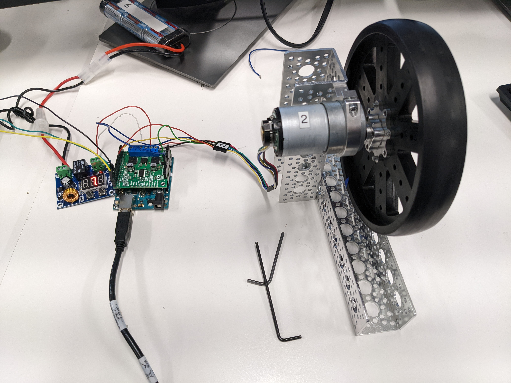

# Arduino Code and Examples

Required Libraries:

* `DualMC33926MotorShield.h` - Installed via Arduino IDE

* `Encoder.h` - Found on git [here]()

## Integration Utilities

EENG350MP

## Feedback Control Utilities and Examples

control

## Localization Examples

## Integration Utilities

EENG350MP

## Feedback Control Utilities and Examples

control

## Localization Examples