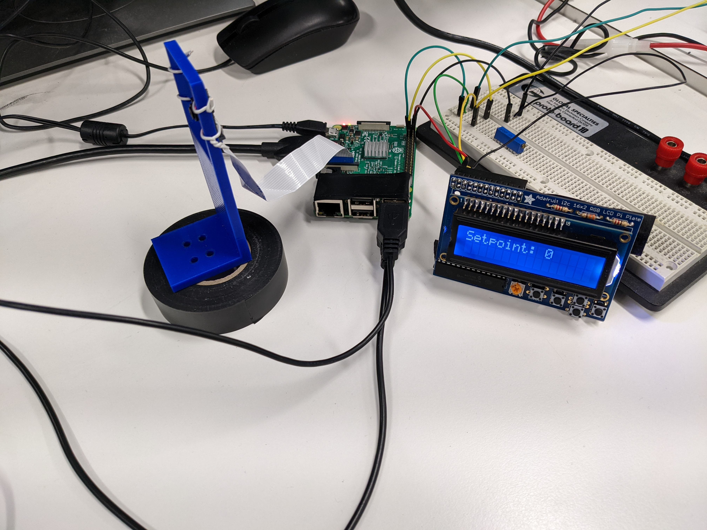

# Raspberry Pi Code and Examples

The imported libraries cv2 and picamera are standard libraries that were given in the assignment 2 computer vision prompt.

## Comp_vis folder:

This folder includes the save location for the constant and test images, which are read in and out by the final.py program.

The python file in this folder was a test file and a proof of concept that was the working file for edits, and was eventually fitted into the final.py file.

